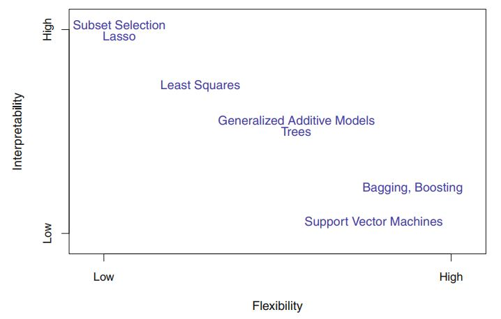

# Chapter 2: Statistical Learning
## What Is Statistical Learning?
The inputs is predictors, independent variables, features, or sometimes just variables, denoted as X.

The output is response or dependent variable, denoted as Y.

For statistical learning we want to device relationship between X & Y.
We can assume it is of below form

  

*f* represents the systematic information that X provides about Y
    
*ε* is a random error term, which is independent of X and has mean zero

## Why Estimate f?
### 1. Prediction

We have input X and output Y cannot be easily obtained, so we predict output Y.

  

Where,

 represents our estimate for f,
one is not typically concerned with the exact form of it, provided that it yields accurate predictions for Y.

 represents the resulting prediction for Y

The accuracy of  as a prediction for Y depends on two quantities,
which we will call the **reducible error** and the **irreducible error**.

* #### Reducible Error 

   will not be a perfect estimate for f, and this inaccuracy will introduce some error.
This error is reducible because we can potentially improve the accuracy of  by using the most appropriate statistical learning technique to estimate f.

* #### Irreducible Error 

  However, even if it were possible to form a perfect estimate for
f, so that our estimated response took the form , our prediction
would still have some error in it! This is because Y is also a function of
ε, which, by definition, cannot be predicted using X. Therefore, variability
associated with ε also affects the accuracy of our predictions. This is known
as the irreducible error, because no matter how well we estimate f, we
cannot reduce the error introduced by ε.

### 2. Inference

In this situation we wish to estimate f, but our goal is not necessarily to make predictions for Y. We instead want to understand
the relationship between X and Y. Now  
cannot be treated as a black box, because we need to know its exact form.
In this setting, one may be interested in answering the following questions:
  * Which predictors are associated with the response?
  * What is the relationship between the response and each predictor?
  * Can the relationship between Y and each predictor be adequately summarized using a linear equation, or is the relationship more complicated? 

### Difference between inference and prediction problem:
* *how much extra will a house be worth if it has a view of the river?* This is an inference problem.
* *is this house under- or over-valued?* This is a prediction problem.

## How Do We Estimate f?
Goal is to apply a statistical learning method to the training data in order to estimate the unknown function *f*.

i.e. find a function  such that  for any observation (*X*, *Y*)

Two Approaches to estimate f
### 1. Parametric Methods
  * Make assumption about functional form or shape of *f*. We call it as model.
    
    e.g. if assumption is *f* is linear in *X*:
    

      
    

  * Use training data to fit or train the model.
    
    e.g. in linear model find values of  such that,
    

      
    

    
  As this methods reduces the problem to finding the parameters, it's called Parametric Method.
    
  :white_check_mark: Easier to estimate parameters

  :x: Model usually will not match true unknown form of *f*, & estimate will be poor.

  We may try to use flexible model, but will require to calculate more parameters and can lead to *overfitting data*.

### 2. Non-Parametric Methods
  :white_check_mark: Do not assume functional from of *f*, instead estimate *f* that goes closer to data points.
  
  :x: Since do not reduce problem to estimating parameters, a very large number of observation required to estimate accurate *f*.

## The Trade-Off Between Prediction Accuracy and Model Interpretability 

### Why would we ever choose to use a more restrictive method instead of a very flexible approach?
* When end goal is inference, the linear model may be a good choice since it will be quite easy to understand
the relationship between *Y* and *Xp*.
* When end goal is prediction, flexible approaches such as the splines or boosting methods may be used for prediction, because interpretability of predictive model is simply not of interest.

## Supervised Versus Unsupervised Learning
  To fit a model that relates the response to the predictors, with the aim of accurately predicting the response for future observations (prediction) or better understanding the relationship between the response and the predictors (inference).
  
  e.g. linear regression, logistic regression, GAM, bosting.

  For every observation if we observe a vector of measurements Xi but no associated response Yi. We lack a response variable that can supervise our analysis. 
  
  e.g. Clustering

Many problems fall naturally into the supervised or unsupervised learning paradigms. However, sometimes the question of whether an analysis should be considered supervised or unsupervised is less clear-cut.

## Regression Versus Classification Problems
Problems with a quantitative response are referred to as regression problems

Problems with a qualitative response are referred to as classification problems.

We tend to select statistical learning methods on the basis of whether the response is quantitative or qualitative; i.e. we might use linear regression when quantitative and logistic regression when qualitative. However, whether the predictors are qualitative or quantitative is generally considered less important.

## Assessing Model Accuracy
No one method dominates all others over all possible data sets.

### Measuring the Quality of Fit
quantify the extent to which the predicted response value for a given observation is close to the true response value for that observation. For this we use Mean Square Error.
    

      
    

Where,

 is prediction  gives for *i*th observation.

If MSE calculated using training data, it is called training MSE.
We want to choose the method that gives the lowest test MSE, as opposed to the lowest training MSE. 
