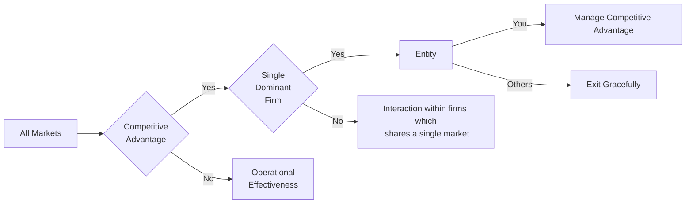

# 1. Strategy, Markets, And Competition
#### Strategy vs Tactics:  
* Decision to enter a market is Strategy. Once entered, success depends on skillful implementation  
  * Efficient performance  
  * Marketing campaign  
  * Appropriate investment  
  * Design & engineering time  
  * Management attention to continuous improvement
* If size of the market is huge, no company need to think about actions of its competition and success depends on skillful implementation.
* Strategic choices are outward looking. Strategic choice involves two issues:
  * Selecting the arena of competition, the market in which to engage
    * e.g., IBM in PC markets outsourced OS to Microsoft and Processors to Intel
  * Management of those external agents
    * Even with world class disciplines, no one can predict with absolute certainty, how other companies CEO will respond to your latest move. Yet Management need to device a strategy by taking that response into account.
#### On the Porter's Five Forces:
* Among five forces _**Potential of new entrants (Barriers to entry) is much more important than others.**_
  1. Competition in the industry
  2. _**Potential of new entrants into the industry**_
  3. Power of suppliers
  4. Power of customers
  5. Threat of substitute products

* Operational effectiveness the only strategy appropriate in markets without barriers to entry, does not require consideration of all external interactions.
* Barriers to entry and incumbent competitive advantage are same things.
* Sources of competitive advantages are local and specific, not general or diffuse.
* Most companies' manages to grow and achieve high profitability using:
  1. Replicate local advantages in multiple markets. e.g. Coca-Cola
  2. Focus within their product space as the product space become bigger. e.g. Intel, 
  3. Gradually expand their activities outward from the edge of dominant market positions. e.g. Walmart, Microsoft

#### Competitive Strategies
* Approaches in developing competitive strategy between entities sharing a single market:
  1. Know which Game to apply (Players, Actions, Motives, Rules) - 
     a. Play Prisoner's Dilemma when long-live price wars happened in history of an industry
     b. Play Entry/Preemptive when expansion of one firm is countered by expansion of another rival
  2. Simulation
  3. Cooperative analysis.

* Only few types of competitive advantages (demand, supply & economies of scale) and two tests (market-share stability and high ROC)

