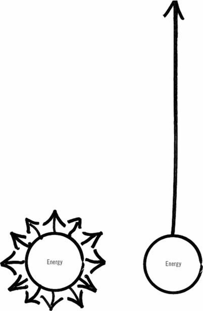

**Nonessentilaism** is applying energy in all direction and hence making small progress in all direction. This will give us  the unfulfilling experience of making a millimeter of progress in a million directions. 
**Essentialism** is investing in fewer things we have to get the satisfying experience of making significant progress in the things that matter most.

It is not about how to get more things done; it’s about how to get the right things done. It doesn’t mean just doing less for the sake of less either. It is about making the wisest possible investment of your time and energy in order to operate at our highest point of contribution by doing only what is essential.

| |Nonessentialist | Essentialist|
|---|---|---|
|Thinks | **ALL THINGS TO ALL PEOPLE** “I have to.” “It’s all important.” “How can I fit it all in?”  |	**LESS BUT BETTER**  “I choose to.” “Only a few things really matter.” “What are the trade-offs?” 
|Does	| **THE UNDISCIPLINED PURSUIT OF MORE** Reacts to what’s most pressing Says “yes” to people without really thinking Tries to force execution at the last moment| **THE DISCIPLINED PURSUIT OF LESS** Pauses to discern what really matters Says “no” to everything except the essential Removes obstacles to make execution easy|
|Gets| **LIVES A LIFE THAT DOES NOT SATISFY** Takes on too much, and work suffers Feels out of control Is unsure of whether the right things got done Feels overwhelmed and exhausted| **LIVES A LIFE THAT REALLY MATTERS** Chooses carefully in order to do great work Feels in control Gets the right things done Experiences joy in the journey|

# 1. ESSENCE: WHAT IS THE CORE MIND-SET OF AN ESSENTIALIST?
## Choose: The Invincible Power of Choice

| Nonessentialist                   | Essentialist                    |
| ---|---|
| “I have to.”                      | “I choose to.”                  |
| Forfeits the right to choose      | Exercises the power of choice   |

## Discern: The Unimportance of Practically Everything

| Nonessentialist                   | Essentialist                    |
| ---|---|
| Thinks almost everything is essential | Thinks almost everything is nonessential |
| Views opportunities as basically equal | Distinguishes the vital few from the trivial many |

## Trade-off: Which Problem Do I Want?

| Nonessentialist                   | Essentialist                    |
| ---|---|
| Thinks, “I can do both.” Asks, “How can I do it all?”| Asks, “What is the trade-off I want to make?” Asks, “What can I go big on?”||

# 2. EXPLORE: DISCERNING THE TRIVIAL MANY FROM THE VITAL FEW

## Escape: The Perks of Being Unavailable

| Nonessentialist                   | Essentialist                    |
| ---|---|
| Is too busy doing to think about life | Creates space to escape and explore life |

## Look: See What Really Matters

| Nonessentialist                   | Essentialist                    |
| ---|---|
| Pays attention to the loudest voice Hears everything being said Is overwhelmed by all the information  | Pays attention to the signal in the noise Hears what is not being said Scans to find the essence of the information |

## Sleep: Protect the Asset

| Nonessentialist                   | Essentialist                    |
| ---|---|
|**THINKS**: One hour less of sleep equals one more hour of productivity. Sleep is for failures. Sleep is a luxury. Sleep breeds laziness. Sleep gets in the way of “doing it all.”|**KNOWS**: One hour more of sleep equals several more hours of much higher productivity. Sleep is for high performers. Sleep is a priority. Sleep breeds creativity. Sleep enables the highest levels of mental contribution.|

## Select: The Power of Extreme Criteria

| Nonessentialist                   | Essentialist                    |
| ---|---|
|Says yes to almost every request or opportunity Uses broad, implicit criteria like “If someone I know is doing it, I should do it.”|Says yes to only the top 10 percent of opportunities Uses narrow, explicit criteria like “Is this exactly what I am looking for?”|

# 3. ELIMINATE: CUTTING OUT THE TRIVIAL MANY

## Clarity: One Decision That Makes a Thousand

| Nonessentialist                   | Essentialist                    |
| ---|---|
|Has a vague, general vision or mission statement Has concrete quarterly objectives but ones that fail to energize or inspire people to take their efforts to the next level Has a value set but no guiding principles for implementing them|Has a strategy that is concrete and inspirational Has an intent that is both meaningful and memorable Makes one decision that eliminates one thousand later decisions|

## Dare: The Power of a Graceful “No”

| Nonessentialist                   | Essentialist                    |
| ---|---|
|Avoids saying no to avoid feeling social awkwardness and pressure Says yes to everything|Dares to say no firmly, resolutely, and gracefully Says yes only to the things that really matter|

## Uncommit: Win Big by Cutting Your Losses

| Nonessentialist                   | Essentialist                    |
| ---|---|
|Asks, “Why stop now when I’ve already invested so much in this project?” Thinks, “If I just keep trying, I can make this work.” Hates admitting to mistakes|Asks, “If I weren’t already invested in this project, how much would I invest in it now?” Thinks, “What else could I do with this time or money if I pulled the plug now?” Comfortable with cutting losses|

## Edit: The Invisible Art

| Nonessentialist                   | Essentialist                    |
| ---|---|
|Thinks that making things better means adding something Attached to every word, image, or detail|Thinks that making things better means subtracting something Eliminates the distracting words, images, and details|

## Limit: The Freedom of Setting Boundaries

| Nonessentialist                   | Essentialist                    |
| ---|---|
|Thinks if you have limits you will be limited Sees boundaries as constraining Exerts effort attempting the direct “no”|Knows that if you have limits you will become limitless Sees boundaries as liberating Sets rules in advance that eliminate the need for the direct “no”|

# STEP 3. EXECUTE: REMOVING OBSTACLES AND MAKING EXECUTION EFFORTLESS

## Buffer: The Unfair Advantage

| Nonessentialist                   | Essentialist                    |
| ---|---|
|Assumes the best-case scenario will happen Forces execution at the last minute|Builds in a buffer for unexpected events Practices extreme and early preparation|

## Subtract: Bring Forth More by Removing Obstacles

| Nonessentialist                   | Essentialist                    |
| ---|---|
|Piles on quick-fix solutions Does more|Removes obstacles to progress Brings forth more|

## Progress: The Power of Small Wins

| Nonessentialist                   | Essentialist                    |
| ---|---|
|Starts with a big goal and gets small results Goes for the flashiest wins|Starts small and gets big results Celebrates small acts of progress|

## Flow: The Genius of Routine

| Nonessentialist                   | Essentialist                    |
| ---|---|
|Tries to execute the essentials by force Allows nonessentials to be the default|Designs a routine that enshrines what is essential, making execution almost effortless Makes the essential the default position|

## Focus: What’s Important Now?

| Nonessentialist                   | Essentialist                    |
| ---|---|
|Mind is spinning out about the past or the future Thinks about what was important yesterday or tomorrow Worries about the future or stresses about the past|Mind is focused on the present Tunes in to what is important right now Enjoys the moment|

## Be: The Essentialist Life
People with Essentialism at their core get far more from their investment than those who absorb it only at the surface level.
