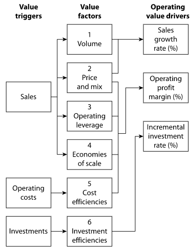

## The Case for Expectations Investing
* The ability to properly read market expectations and anticipate revisions of these expectations is the springboard for earning superior long-term returns.

### The Expectations Investing Process
**Step 1: Estimate Price-Implied Expectations**: DCF to find out expectations

**Step 2: Identify Expectations Opportunities**: Using appropriate strategy and financial tools to determine where and when revisions in expectations are likely to occur

**Step 3: Buy, Sell, or Hold**? - Define clear standards for buy and sell decisions

## The Expectations Infrastructure

* **Value triggers**: expectations revisions can happen in sales, operating costs, and investments.

* The relationship between the value triggers and the **value drivers** is **value factors**.
    - volume
    - price and mix
    - operating leverage
    - economies of scale
    - cost efficiencies
    - investment efficiencies

* Sales trigger four of the six value factors, but revisions in expectations for sales growth are typically the largest

* Revisions in expectations due to cost and investment efficiencies are almost always smaller.

* Sales growth 
    - adds value when a company generates returns on its growth investments that exceed its cost of capital
    - destroys value when returns fall below the cost of capital
    - adds no value when a company earns exactly the cost of capital

* A company adds value when the present value of incremental net operating profit after taxes (NOPAT) exceeds incremental investment. NOPAT growth, in turn, depends on the expected sales growth rate, operating profit margin, and assumed cash tax rate.
