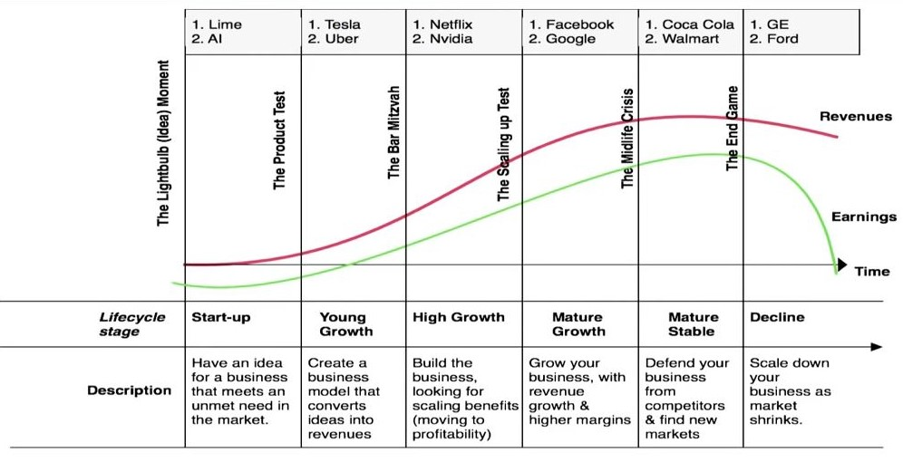

### PREPARING TO INVEST
* Don’t overestimate the skill and wisdom of professionals.
* Take advantage of what you already know.
* Look for opportunities that haven’t yet been discovered and certified by Wall Street - companies that are “off the radar scope.”
* Invest in a house before you invest in a stock.
* Invest in companies, not in the stock market.
* Ignore short-term fluctuations.
* Large profits can be made in common stocks.
* Large losses can be made in common stocks.
* Predicting the economy or short-term direction of the stock market is futile.
* The long-term returns from stocks are both relatively predictable and also far superior to the long-term returns from bonds.
* Keeping up with a company in which you own stock is like playing an endless stud-poker hand.
* Common stocks aren’t for everyone, nor even for all phases of a person’s life.
* The average person is exposed to interesting local companies and products years before the professionals.
* Having an edge will help you make money in stocks.
* In the stock market, one in the hand is worth ten in the bush.

### Stalking the Tenbagger
* You don’t have to be a vice president at Exxon to sense the growing prosperity in that company, or a turnaround in oil prices.
You can be a roustabout, a geologist, a driller, a supplier, a gas-station owner, a grease monkey, or even a client at the gas pumps.
* You don’t have to work in Kodak’s main office to learn that the new generation of inexpensive, easy-to-use, high-quality 35mm cameras from Japan is reviving the photo industry, and that film sales are up.
You could be a film salesman, the owner of a camera store, or a clerk in a camera store.
You could also be the local wedding photographer who notices that five or six relatives are taking unofficial pictures at weddings and making it harder for you to get good shots.
* You don’t have to be Steven Spielberg to know that some new blockbuster, or string of blockbusters, is going to give a significant boost to the earnings of Paramount or Orion Pictures.
You could be an actor, an extra, a director, a stuntman, a lawyer, a gaffer, the makeup person, or the usher at a local cinema, where the standing-room-only crowds six weeks in a row inspire you to investigate the pros and cons of investing in Orion’s stock.
* If I’d seen how my youngest daughter, Beth, loves the Disney channel, how much Annie looks forward to watching Nickelodeon, how my oldest daughter Mary appreciates MTV, how Carolyn takes to the old Bette Davis movies and I take to CNN news and cable sports, I would have understood that cable is as much of a fixture as water or electricity—the video utility. It’s impossible to say enough about the value of personal experience in analyzing companies and trends.

### I’ve Got It, I’ve Got It—What Is It?

#### BIG COMPANIES, SMALL MOVES
The size of a company has a great deal to do with what you can expect to get out of the stock. How big is this company in which you’ve taken an interest? Specific products aside, big companies don’t have big stock moves. In certain markets they perform well, but you’ll get your biggest moves in smaller companies. You don’t buy stock in a giant such as Coca-Cola expecting to quadruple your money in two years. If you buy Coca-Cola at the right price, you might triple your money in six years, but you’re not going to hit the jackpot in two.

GE has 900 million shares outstanding, and a total market value of $39 billion.
The annual profit, more than $3 billion, is enough to qualify as a Fortune 500 company on its own. There is simply no way that GE could accelerate its growth very much without taking over the world. And since fast growth propels stock prices, it’s no surprise that GE moves slowly.

#### THE SIX CATEGORIES
six categories cover all of the useful distinctions that any investor has to make.
1. Slow growers
    * Large and aging companies are expected to grow slightly faster than the GDP.
    Slow growers didn’t start out that way. They started out as fast growers and eventually pooped out, either because they had gone as far as they could, or else they got too tired to make the most of their chances.
    * When an industry at large slows down (as they always seem to do), most of the companies within the industry lose momentum as well. Sooner or later every popular fast-growing industry becomes a slow-growing industry, and numerous analysts and prognosticators are fooled.
    * Cars became the fast-growth industry, and for a time it was steel, then chemicals, then electric utilities, then computers.

2. Stalwarts
    * Stalwarts are (Coca-Cola, P&G, Colgate-Palmolive) multibillion-dollar hulks, not exactly agile climbers, but they’re faster than slow growers.
    * 10 to 12 percent annual growth in earnings.
    * If a stalwart gone up 50 percent in a year or two, you have to wonder if maybe that’s enough and begin to think about selling.
    * They offer pretty good protection during recessions and hard times. You know they won’t go bankrupt, and soon enough they will be reassessed and their value will be restored.

3. Fast growers
    * Small, aggressive new enterprises that grow at 20 to 25 percent a year. If you choose wisely, this is the land of the 10-to 40-baggers, and even the 200-baggers..
    * There’s plenty of risk in fast growers, especially in the younger companies that tend to be overzealous and underfinanced.
    * Look for the ones that have good balance sheets and are making substantial profits. The trick is figuring out when they’ll stop growing, and how much to pay for the growth.

4. Cyclicals
    * The autos, airlines, tire, steel, defense and chemical companies are all cyclicals.
    * Coming out of a recession and into a vigorous economy, the cyclicals flourish, and their stock prices tend to rise much faster than the prices of the stalwarts. This is understandable, since people buy new cars and take more airplane trips in a vigorous economy, and there’s greater demand for steel, chemicals, etc. But going the other direction, the cyclicals suffer, and so do the pocketbooks of the shareholders. You can lose more than fifty percent of your investment very quickly if you buy cyclicals in the wrong part of the cycle, and it may be years before you’ll see another upswing.
    * If a stalwart (Bristol-Myers) can lose half its value in a sorry market and/or a national economic slump, a cyclical (Ford) can lose 80 percent. You have to know that owning Ford is different from owning Bristol-Myers.
    
5. Turnarounds
   * Turnaround candidates have been battered, depressed, and often can barely drag themselves into Chapter 11
   * Turnaround stocks make up lost ground very quickly 
   
6. Asset plays
   * An asset play is any company that’s sitting on something valuable that you know about, but that the Wall Street crowd has overlooked
   * The asset play is where the local edge can be used to greatest advantage.
   * The asset may be as simple as a pile of cash. Sometimes it’s real estate.
   * There are asset plays in metals and in oil, in newspapers and in TV stations, in patented drugs and even sometimes in a company’s losses. The company which has huge tax-loss carryforward, can save corporate tax up front.

#### HIGHFLIERS TO LOW RIDERS
* Companies don’t stay in the same category forever. Fast growers can lead exciting lives, and then they burn out, just as humans can. They can’t maintain double-digit growth forever, and sooner or later they exhaust themselves and settle down into the comfortable single digits of sluggards and stalwarts.
* If you can’t figure out what category your stocks are in, then ask your broker.
* Unless it’s a turnaround, there’s no point in owning a utility and expecting it to do as well as Philip Morris.
* There’s no point in treating a young growth company like a stalwart, and selling for a 50 percent gain, when there’s a good chance that your fast grower will give you a 1,000-percent gain.
* Putting stocks in categories is the first step in developing the story. Now at least you know what kind of story it’s supposed to be. The next step is filling in the details that will help you guess how the story is going to turn out.
##### The Corporate life cycle from [Aswath Damodaran – Laws of Valuation: Revealing the Myths and Misconceptions](https://www.youtube.com/watch?v=c20_S-QgvsA)

### The Perfect Stock, What a Deal!
“Any idiot can run this business” is one characteristic of the perfect company, the kind of stock I dream about. You never find the perfect company, but if you can imagine it, then you’ll know how to recognize favorable attributes, the most important thirteen of which are as follows:
1. **IT SOUNDS DULL—OR, EVEN BETTER, RIDICULOUS** The perfect company has to be engaged in a perfectly simple business, and the perfectly simple business ought to have a perfectly boring name. The more boring it is, the better. What analyst or portfolio manager in his right mind would recommend a boring stock unless of course the Street already realizes how profitable it is, and by then it’s up tenfold already.
2. **IT DOES SOMETHING DULL** It is even more exciting when a company with a boring name also does something boring. A company that does boring things is almost as good as a company that has a boring name, and both together is terrific. Both together is guaranteed to keep the oxymorons away until finally the good news compels them to buy in, thus sending the stock price even higher.
3. **IT DOES SOMETHING DISAGREEABLE** Something that makes people shrug, retch, or turn away in disgust is ideal.
e.g. Periodically the Safety-Kleen people come around to remove the dirty sludge and oil from the machine, and they carry the sludge back to the refinery to be recycled. This goes on and on, and you’ll never see a miniseries about it on network TV.
4. **IT’S A SPINOFF** Spinoffs of divisions or parts of companies into separate, freestanding entities. Large parent companies do not want to spin off divisions and then see those spinoffs get into trouble, because that would bring embarrassing publicity that would reflect back on the parents. Therefore, the spinoffs normally have strong balance sheets and are well-prepared to succeed as independent entities. And once these companies are granted their independence, the new management, free to run its own show, can cut costs and take creative measures that improve the near-term and long-term earnings.
5. **THE INSTITUTIONS DON’T OWN IT, AND THE ANALYSTS DON’T FOLLOW IT** If you find a stock with little or no institutional ownership, you’ve found a potential winner. Find a company that no analyst has ever visited, or that no analyst would admit to knowing about, and you’ve got a double winner.
6. **THE RUMORS ABOUND: IT’S INVOLVED WITH TOXIC WASTE AND/OR THE MAFIA** It’s hard to think of a more perfect industry than waste management. If there’s anything that disturbs people more than animal casings, grease and dirty oil, it’s sewage and toxic waste dumps. People usually thinks that Mafia controls the garbage business. This assertion makes the share underpriced relative to the actual opportunity.
7. **THERE’S SOMETHING DEPRESSING ABOUT IT** Service Corporation International (SCI) provides funeral goods and services as well as cemetery property and services.
8. **IT’S A NO-GROWTH INDUSTRY** As soon as a computer company designs the best word-processor in the world, ten other competitors are spending $100 million to design a better one, and it will be on the market in eight months. This doesn’t happen with bottle caps, coupon-clipping services, oil-drum retrieval, or motel chains. In a no-growth industry, especially one that’s boring and upsets people, there’s no problem with competition. You don’t have to protect your flanks from potential rivals because nobody else is going to be interested.
9. **IT’S GOT A NICHE** Certainly, owning a rock pit is safer than owning a jewelry business. If you’re in the jewelry business, you’re competing with other jewelers from across town, across the state, and even abroad, since vacationers can buy jewelry anywhere and bring it home. But if you’ve got the only gravel pit in Brooklyn, you’ve got a virtual monopoly, plus the added protection of the unpopularity of rock pits. Chemical companies have niches in pesticides and herbicides. It’s not any easier to get a poison approved than it is to get a cure approved. Once you have a patent and the federal go-ahead on a pesticide or a herbicide, you’ve got a money machine.
10. **PEOPLE HAVE TO KEEP BUYING IT** Invest in a company that makes drugs, soft drinks, razor blades, or cigarettes than in a company that makes toys. Why take chances on fickle purchases when there’s so much steady business around?
11. **IT’S A USER OF TECHNOLOGY** Instead of investing in computer companies that struggle to survive in an endless price war, why not invest in a company that benefits from the price war. instead of investing in a company that makes automatic scanners, why not invest in the supermarkets that install the scanners? If a scanner helps a supermarket company cut costs just three percent, that alone might double the company’s earnings.
12. **THE INSIDERS ARE BUYERS** There’s no better tip-off to the probable success of a stock than that people in the company are putting their own money into it.
13. **THE COMPANY IS BUYING BACK SHARES** Buying back shares is the simplest and best way a company can reward its investors. If a company has faith in its own future, then why shouldn’t it invest in itself, just as the shareholders do?

### Stocks I’d Avoid
High growth and hot industries attract a very smart crowd that wants to get into the business. Entrepreneurs and venture capitalists stay awake nights trying to figure out how to get into the act as quickly as possible. If you have a can’t-fail idea but no way of protecting it with a patent or a niche, as soon as you succeed, you’ll be warding off the imitators. In business, imitation is the sincerest form of battery. Remember what happened to disk drives? The experts said that this exciting industry would grow at 52 percent a year—and they were right, it did. But with thirty or thirty-five rival companies scrambling on the action, there were no profits.

There’s never been a hotter stock than Xerox in the 1960s. Copying was a fabulous industry, and Xerox had control of the entire process. “To xerox” became a verb, which should have been a positive development. Many analysts thought so. They assumed that Xerox would keep growing to infinity when the stock was selling for $170 a share in 1972. But then the Japanese got into it, IBM got into it, and Eastman Kodak got into it. Soon there were twenty firms that made nice dry copies, as opposed to the original wet ones. Xerox got frightened and bought some unrelated businesses it didn’t know how to run, and the stock lost 84 percent of its value. Several competitors didn’t fare much better. Copying has been a respectable industry for two decades and there’s never been a slowdown in demand, yet the copy machine companies can’t make a decent living.

Contrast the sorry stock performance of Xerox to that of Philip Morris, a company that sells cigarettes—a negative-growth industry in the U.S. Over the past fifteen years Xerox dropped from $160 to $60, while Philip Morris rose from $14 to $90. Year after year Philip Morris increases its earnings by expanding its market share abroad, by raising prices, and by cutting costs. Because of its brand names—Marlboro, Virginia Slims, Benson & Hedges, Merit, etc.—Philip Morris has found its niche. Negative-growth industries do not attract flocks of competitors.
* BEWARE THE NEXT SOMETHING
* AVOID DIWORSEIFICATIONS: Instead of buying back shares or raising dividends, profitable companies often prefer to blow the money on foolish acquisitions. The dedicated diworseifier seeks out merchandise that is (1) overpriced, and (2) completely beyond his or her realm of understanding. This ensures that losses will be maximized.
* BEWARE THE WHISPER STOCK: These are the longshots, also known as whisper stocks, and the whiz-bang stories. They probably reach your neighborhood about the same time they reach mine: the company that sells papaya juice derivative as a cure for slipped-disc pain (Smith Labs); jungle remedies in general; high-tech stuff; monoclonal antibodies extracted from cows (Bioresponse); various miracle additives; and energy breakthroughs that violate the laws of physics. Often the whisper companies are on the brink of solving the latest national problem: the oil shortage, drug addiction, AIDS. The solution is either (a) very imaginative, or (b) impressively complicated.
* BEWARE THE MIDDLEMAN: The company that sells 25 to 50 percent of its wares to a single customer is in a precarious situation.
* BEWARE THE STOCK WITH THE EXCITING NAME: As long as it has “advanced,” “leading,” “micro,” or something with an x in it, or it’s a mystifying acronym, people will fall in love with it.

### Earnings, Earnings, Earnings
* Although it’s easy to forget sometimes, a share of stock is not a lottery ticket. It’s part ownership of a business.
People may wonder what the Japanese are doing and what the Koreans are doing, but ultimately the earnings will decide the fate of a stock. People may bet on the hourly wiggles in the market, but it’s the earnings that waggle the wiggles, long term.
* P/E RATIO is a numerical shorthand for the relationship between the stock price and the earnings of the company.
* The p/e ratio can be thought of as the number of years it will take the company to earn back the amount of your initial investment— assuming, of course, that the company’s earnings stay constant.
* The fact that some stocks have p/e’s of 40 and others have p/e’s of 3 tells you that investors are willing to take substantial gambles on the improved future earnings of some companies, while they’re quite skeptical about the future of others.
* An average p/e for a utility will be lower than the average p/e for a stalwart, and that in turn will be lower than the average p/e of a fast grower. What’s a bargain p/e for a Dow Chemical isn’t necessarily the same as a bargain p/e for a Wal-Mart.
